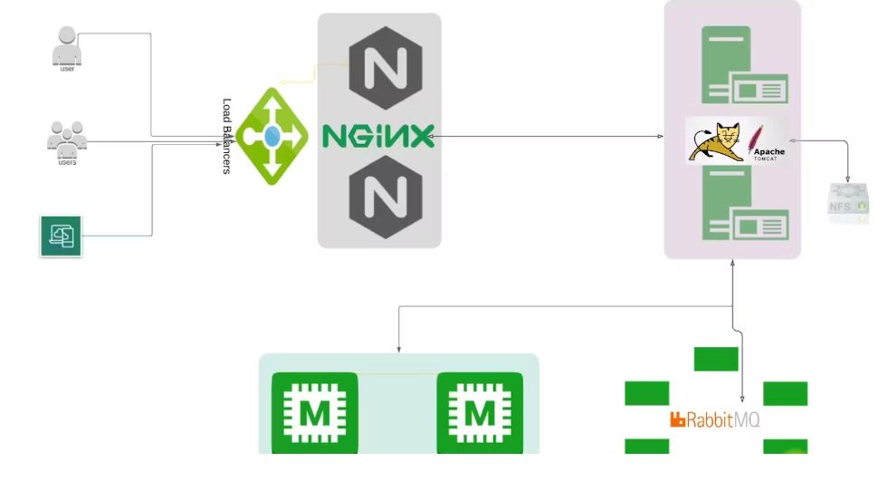
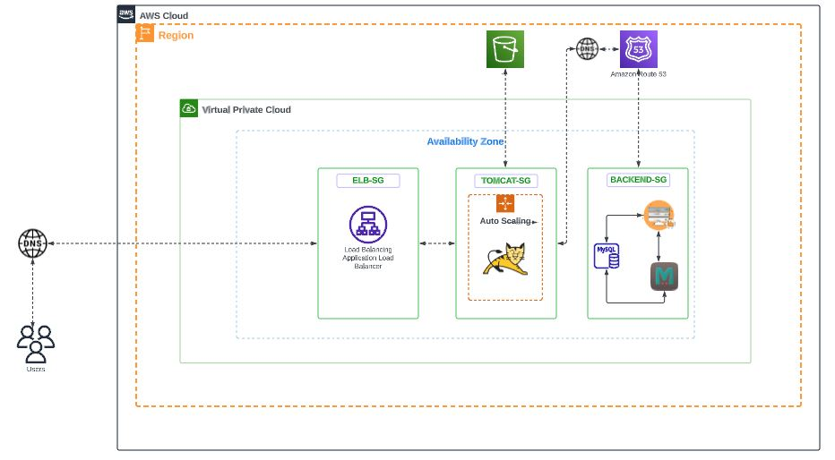

# Java-Web-Application Migration From On-premise To AWS Cloud Using The Lift And Shift Strategy
This repository contains a bash script application source-code to migrate a java web application with MYSQL, Tomcat, Memcache, and RabbitMq from on-premise server to the AWS cloud

### INTRODUCTION

As organizations embark on their digital transformation journeys, they are actively seeking pathways to rejuvenate, innovate, and align their application ecosystems with the cutting-edge technologies offered by major public cloud giants like AWS, Azure, and Google Cloud Platform. The lift and shift strategy has emerged as a practical and efficient approach for migrating applications to the cloud, enabling organizations to harness the benefits of scalability, flexibility, and cost-effective solutions, offered by cloud platforms.

This journey of migration becomes even more crucial when dealing with complex and interconnected systems, such as a Java Spring Boot web application powered by Tomcat, RabbitMQ, Memcached, and MySQL. These technologies are the backbone of many enterprise-grade applications, and migrating them seamlessly to a cloud environment requires careful planning, execution, and coordination.

In this migration endeavor, we will delve into the intricacies of transferring an existing on-premises Java Spring Boot application, along with its dependent services, to a cloud-based infrastructure. Our primary focus will be on preserving the functionality, performance, and reliability of the application during and after the migration.

This comprehensive guide will walk you through the step-by-step process of moving your Java Spring Boot application to the cloud using the lift and shift strategy. We will cover each component of the application stack, addressing specific considerations for Tomcat, RabbitMQ, Memcached, and MySQL. By the end of this migration journey, you will have a clear understanding of how to adapt your Java Spring Boot application to the cloud environment while ensuring minimal disruption to your users and business operations.

### ARCHITECTURAL DIAGRAM
<h4>The architectural diagram of the on-premise multitier java-web-application</h4>

### RESOURCE REQUIREMENTS
- [x] AWS OR ANY CLOUD PROVIDER
- [x] 4 EC2 INSTANCES
- [x] 1 APPLICATION LOAD-BALANCER
- [x] 3 SECURITY GROUPS
- [x] 2 HOSTED ZONES (ONE EACH FOR PRIVATE AND PUBLIC)
- [x] DOMAIN NAME
- [x] KEY-PAIR

### SOFTWARE REQUIREMENTS

| Name | Version |
|------|---------|
|  [MYSQL](#requirement\_MYSQL) | => 5.5 |
|  [TOMCAT ](#requirement\_) | => 8.0 |
|  [JDK](#requirement\_) | => 8.0 |
|  [MAVEN](#requirement\_) | => 2 |
|  [MEMCACHE](#requirement\_) | => 1.6.XX |
|  [RABBITMQ](#requirement\_) | => 3.XX |

